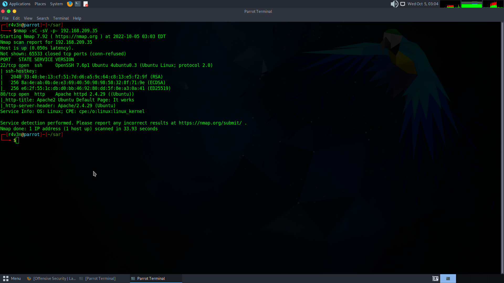
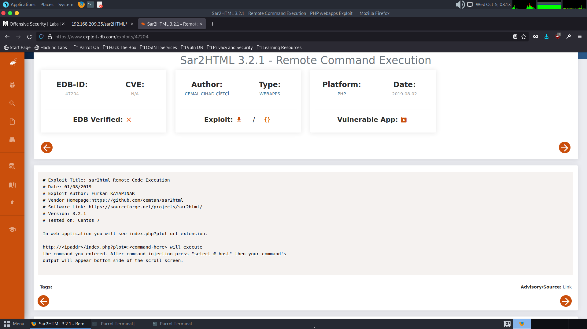
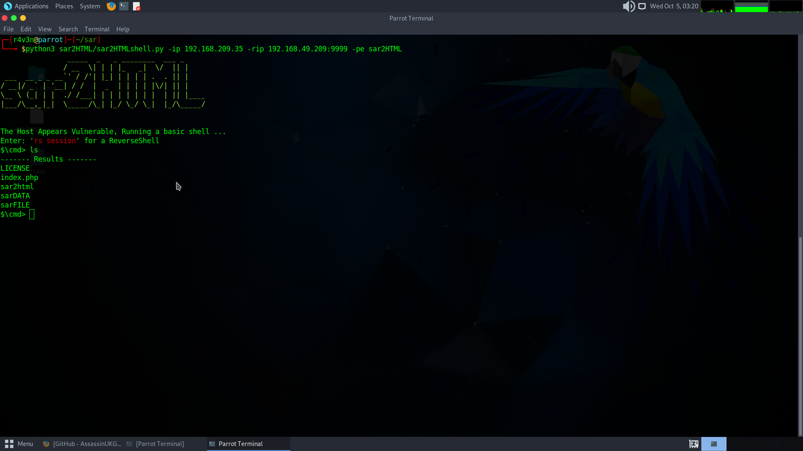
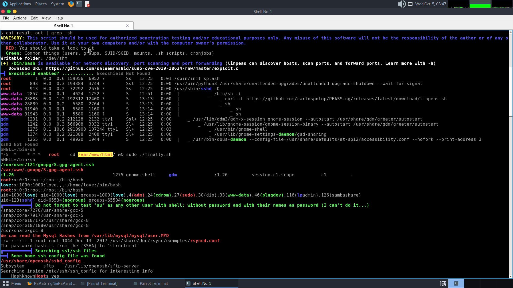
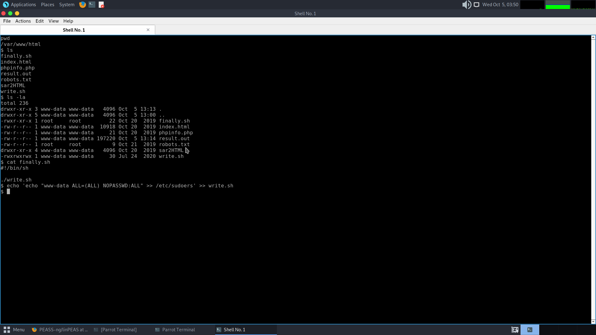
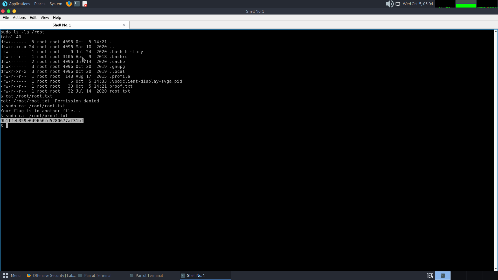

# InfosecPrep

### port enumeration :
first thing to start with is the is port descovery, soo i should run nmap to detect which ports are openned

```sh
 nmap -sC -sV -p- <ip>
```

- -sC to run standard script 
- -sV to get service version
- -p- for all ports
  


as we see on the screenshot above there is tree open ports.

- 22 default port for ssh
- 80 default port for http
- 33060 runs mysql server


### directory enumeration :

from the nmap scan, now we know that an http server is runing on this ip, we shoult run derectory enumeration to see if there is any directory or file that contain potetial sensitive date.
for this purpose i used a tool called dirsearch 

```bash
    python3 dirsearch.py -u <ip> -i 200
```
- -u for url
- -i to include only `200` response status


as we see on the screenshot above there is a file called /robots.txt

[robots.txt image]

on that file i found that there is another file called /secret.txt

[secret.txt image]

on that file i found that there is 64base encoded text.
after decoding it, i found out that it is an ssh private key, i decoded it a second time to get the name of the user for that key, a found out that the name of this user is oscp.


i saved the private key on a file and i connect to over ssh using the key
```bash
    ssh -i private_key_file oscp@<ip>
```
- -i for identity file


i ran linpeas script to detect if there is a way for me to gain root access, and a found out that i can run bash with root privileges.
after runing bash with `bash -p` now im root.
 


### conclusion:
to secure this machine we should not let any sensitive data exposed in the web server, and prevent any user from using root privileges to run any progrem, and if we have to, we could give him privilege on sudoers file.

# sar :

### port enumeration :
first thing to start with is the is port descovery, soo i should run nmap to detect which ports are openned

```sh
 nmap -sC -sV -p- <ip>
```



- apache server on port 80
- ssh port on port 22

### directory enumeration :

from the nmap scan, now we know that an http server is runing on this ip, we shoult run derectory enumeration to see if there is any directory or file that contain potetial sensitive date.
for this purpose i used a tool called dirsearch 

```bash
    python3 dirsearch.py -u <ip> -i 200
```

i found a file `/robots.txt` that cotains a direcotory with the name sar2HTML, that is of a directory of sar2HTM package 3.2.1, this version has a CVE.



we can execute remote command using this package.
i used a python script to get reverse shell access


now i have to find a way to get root privilege.
so i ran linpeas script to find if there is way so i can get access.



i found out tha there is a crontab with the root privilege of a shell script that exist on the root directory of the web server, that mean that there is a possibility of modifying that script because im logged in with the www-data the owner of that direcoty.
i found out that i cant modify on it but it execut a another shell script that i can modify on it

so i wrote on it a code that make me execute sudo commands with no password asked.


the cron tab executes the script every 5 min, so i have to wait for the script to take effect.

ifter that i could use sudo with no password:


### conclusion :
using vulnerable packeges could lead to a disaster, to secure this server we could use a patched version of that package, and should not run cron tabs with root privilage to execute non protected scripts.